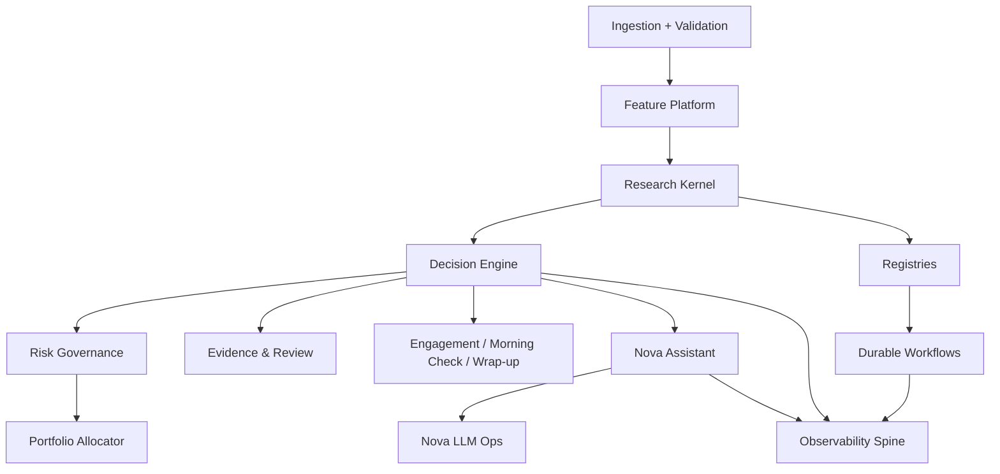

# NovaQuant Backend Architecture After Refactor

Last updated: 2026-03-23

Implementation lives primarily under **`src/server/`** with HTTP entry at **`src/server/api/app.ts`**. Split deploy packages (`server/`, `api/`) reuse this tree; see [`REPOSITORY_OVERVIEW.md`](REPOSITORY_OVERVIEW.md).

## Intent

NovaQuant is no longer organized as a loose collection of signal logic plus an assistant wrapper.
It now has a clearer backend spine:

- research kernel
- decision engine
- risk governance
- feature/data platform
- registries
- Nova LLM ops
- durable workflows
- observability
- portfolio allocator
- evidence/review layer

Frontend philosophy is unchanged:

- one-line judgment
- Today Risk
- ranked action cards
- Nova assistant

The complexity remains in the backend.

## Module Map

## Core Data Flow

### Research Flow

1. Ingested bars and runtime state are validated.
2. Feature contracts define which state is point-in-time safe.
3. Research kernel organizes:
   - hypothesis
   - rolling backtest
   - replay validation
   - promotion review
4. Experiment lineage is attached to strategy versions, backtest runs, and experiment registry records.

### Decision Flow

1. Runtime state loads signals, market state, performance, and user risk profile.
2. Decision engine normalizes raw signal candidates.
3. Risk governance applies upper-layer policy.
4. Portfolio allocator maps universal signals into personalized action semantics.
5. Action cards and evidence bundles are persisted as decision snapshots.
6. Engagement layer consumes decision snapshots for:
   - Morning Check
   - widget summary
   - notification preview
   - wrap-up

### Nova / LLM Ops Flow

1. Nova uses a local-first Ollama route.
2. Task routing is explicit:
   - fast tagging -> Nova-Scout
   - core reasoning -> Nova-Core
   - retrieval embeddings -> Nova-Retrieve
3. Prompt versions and model versions are stored in registries.
4. Chat audit and trace spine keep LLM behavior reviewable.

### Observability Flow

1. Decision generation writes audit events with trace ids.
2. Workflow runs carry trace ids.
3. Chat audit logs record provider behavior.
4. Backbone summary correlates:
   - audit events
   - workflows
   - prompt/model registries
   - decision snapshots

## New Canonical Surfaces

### Domain Contracts
- `/src/server/domain/contracts.ts`

Defines canonical backend-facing objects:
- `ResearchTask`
- `StrategyCandidate`
- `RiskState`
- `PortfolioIntent`
- `ActionCard`
- `EvidenceBundle`
- `FeatureSpec`
- `ValidationResult`
- `ExperimentRun`
- `ModelVersion`
- `PromptVersion`
- `WorkflowRun`
- `RecommendationReview`

### Feature Platform
- `/src/server/feature/platform.ts`

Adds:
- feature registry
- point-in-time contract
- offline/online parity notes
- validation gates
- cache isolation dimensions

### Registry Layer
- `/src/server/registry/service.ts`

Adds unified views for:
- strategies
- experiments
- models
- prompts
- evals
- workflows

### Nova LLM Ops
- `/src/server/ai/llmOps.ts`

Adds:
- local Nova model plan
- route policies
- prompt pack definitions
- prompt/model registry seeding

### Durable Workflows
- `/src/server/workflows/durable.ts`

Adds blueprint layer for:
- nightly validation
- evidence refresh
- replay/paper comparison
- shadow decision review
- prompt eval refresh

### Observability Spine
- `/src/server/observability/spine.ts`

Adds:
- trace id generator
- audit event writer
- observability summary
- metrics catalog

### Portfolio Allocator
- `/src/server/portfolio/allocator.ts`

Adds:
- allocator abstraction
- overlap / concentration awareness
- universal vs personalized separation
- rebalance / rotate / hedge semantics

### Scorecards / Self-Proof Foundation
- `/src/server/evals/scorecards.ts`

Adds:
- decision quality summary
- no-action value score
- explanation effectiveness score
- risk call quality proxy
- user alignment placeholder

### Backbone Summary
- `/src/server/backbone/service.ts`
- `GET /api/backbone/summary`

This is the inspectable top-level snapshot of the professional backend spine.

## Why This Refactor Matters

Before this refactor, NovaQuant already had strong subsystems.
What was missing was a single coherent backend skeleton that made them feel like parts of one professional system.

After this refactor:

- the repository reads more like institutional software
- the core contracts are explicit
- research, decision, risk, evidence, LLM ops, observability, and workflow are inspectable together
- future work can extend one backbone rather than adding parallel subsystems
